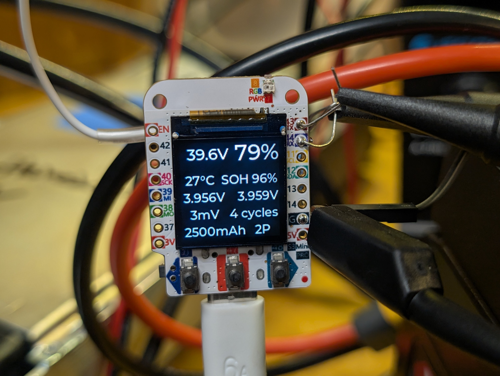
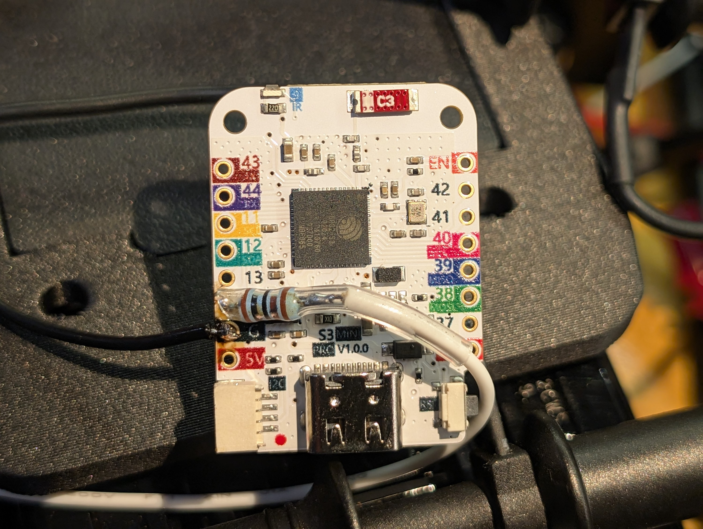
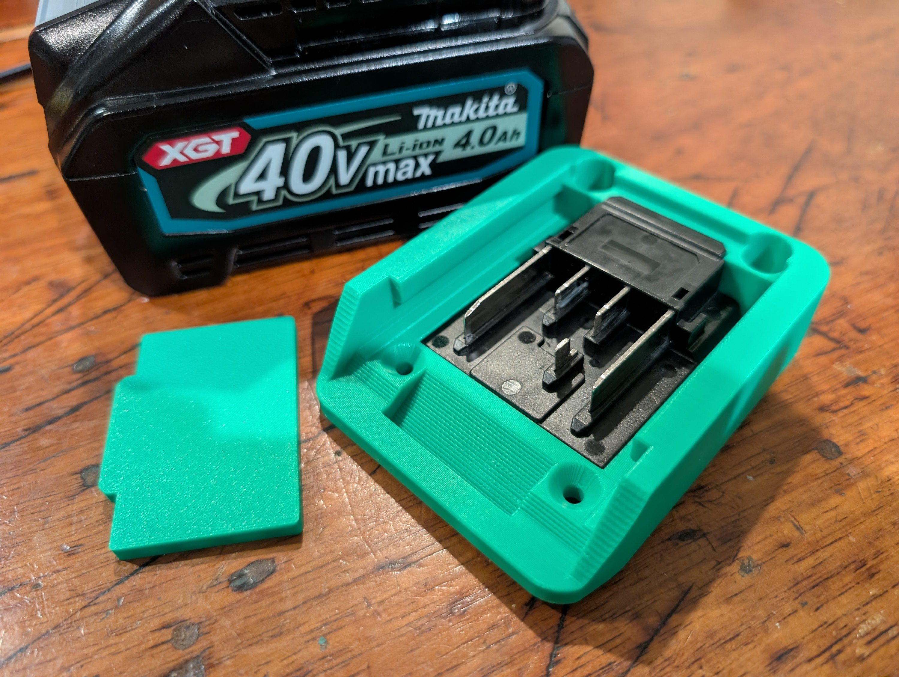
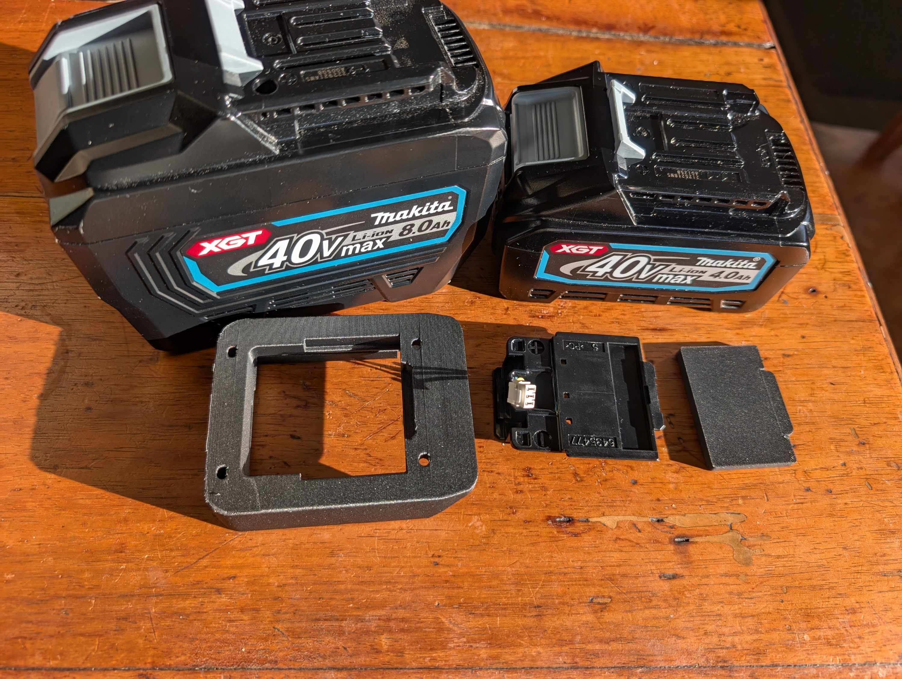
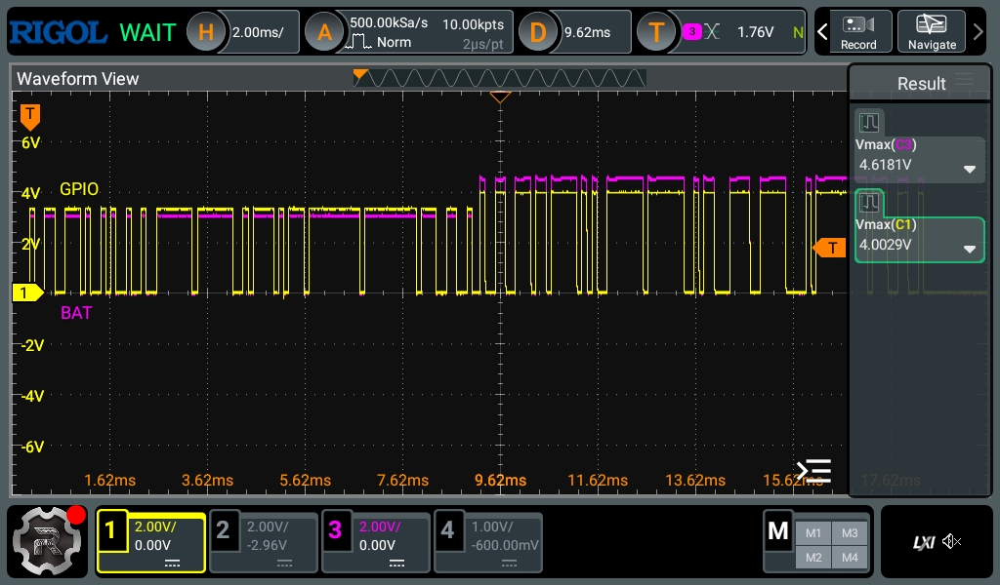

# XGT Battery Component for ESPHome

This component provides comprehensive integration with Makita XGT battery packs through UART communication, featuring real-time monitoring and optional display integration.


*Real-time battery monitoring display showing voltage, charge percentage, temperature, and cell diagnostics*

## Features

- Real-time battery monitoring (voltage, temperature, charge level, health)
- Individual cell voltage monitoring (up to 10 cells)
- Advanced cell diagnostics (min/max cell voltages, cell divergence)
- Battery diagnostics (charge cycles, cell capacity, parallel cell count)
- Battery model identification
- Non-blocking state machine implementation
- LVGL display integration support for real-time visualization
- Hardware button support for user interaction

## Hardware Compatibility

### Supported Platforms:
- **ESP32** (all variants including ESP32-S3)
- **Tested Configuration**: Lolin S3 Mini Pro board
- **Display Support**: 128x128 ILI9xxx displays (ST7789V)
- **Additional Hardware**: WS2812 LED support, physical buttons

### Hardware Requirements:
- ESP32 microcontroller
- Direct connection to XGT battery communication pins
- Optional: SPI display for real-time monitoring interface


*Simplified one wire hardware setup showing ESP32 connected directly to XGT battery data line (half duplex configuration)*

### XGT Battery Connector Details


*XGT battery connector showing white wire (TR data line) and connection points. Ground is obtained from main battery +/- terminals*


*Close-up view of XGT connector - white wire carries the bidirectional TR (TX/RX) data signal*

### Simplified Hardware Interface

The XGT battery communication can be implemented with a simple single-resistor interface:

**Hardware Setup:**
- **Single Resistor**: Connect a 1kΩ resistor from ESP32 GPIO14 to XGT battery data line
- **Ground Connection**: Connect ESP32 ground to battery negative terminal
- **Configuration**: Use GPIO14 as both TX and RX (half-duplex UART)

**Component Values:**
- **R1**: 1kΩ (current limiting resistor from GPIO14 to XGT data line)

**Circuit Operation:**
- GPIO14 functions as a bidirectional data line with current limiting
- The single resistor provides sufficient current limiting and signal conditioning
- TX pin must be configured as inverted in software
- Half-duplex operation handles bidirectional communication on single pin
- Requires external UART component with half-duplex support


*Oscilloscope trace showing XGT battery communication protocol with proper signal inversion and timing*

## Critical UART Configuration Requirements

⚠️ **IMPORTANT**: The XGT battery requires specific UART settings to function properly:

### Required UART Settings:
- **Baud Rate**: 9600
- **Half-Duplex**: true - **CRITICAL FOR SINGLE-PIN OPERATION**
- **Parity**: EVEN (8E1 format) - **CRITICAL FOR PROPER COMMUNICATION**
- **Data Bits**: 8
- **Stop Bits**: 1
- **Signal Inversion**: TX pin must be inverted
- **External Component**: ssieb/esphome uarthalf branch required

### Example UART Configuration:

```yaml
# Required external component for half-duplex UART support
external_components:
  - source:
      type: git
      url: https://github.com/ssieb/esphome
      ref: uarthalf
    components: [ uart ]
    refresh: 0s

uart:
  - id: xgt_uart
    baud_rate: 9600
    half_duplex: true     # CRITICAL: Enable half-duplex mode for single-pin operation
    parity: EVEN          # CRITICAL: Must be EVEN parity (8E1)
    tx_pin: 
      number: GPIO14
      inverted: true      # CRITICAL: Must be inverted
```

**Failure to set parity to EVEN will result in runtime warnings and communication failures.**

## Available Sensors

### Main Battery Sensors:
- **battery_voltage**: Pack voltage (V)
- **battery_temperature**: Battery temperature (°C)
- **battery_charge**: State of charge percentage (%)
- **battery_health**: State of health percentage (%)

### Advanced Cell Monitoring:
- **min_cell_voltage**: Lowest cell voltage across all cells (V)
- **max_cell_voltage**: Highest cell voltage across all cells (V)
- **cell_divergence**: Voltage difference between min/max cells (V)
- **cell_voltage**: Individual cell voltages (cell_1 through cell_10)

### Diagnostic Sensors:
- **num_charges**: Total battery charge cycles
- **cell_size**: Individual cell capacity (mAh)
- **parallel_count**: Number of parallel cell groups

## Usage

### Basic Configuration:

```yaml
# External Components
external_components:
  - source:
      type: git
      url: https://github.com/ssieb/esphome
      ref: uarthalf
    components: [ uart ]
    refresh: 0s
  - source: components
    components: [xgt_battery]

# UART Configuration (with half-duplex support)
uart:
  - id: xgt_uart
    baud_rate: 9600
    half_duplex: true     # CRITICAL: Enable half-duplex mode for single-pin operation
    parity: EVEN          # CRITICAL: XGT battery requires EVEN parity
    tx_pin: 
      number: GPIO14
      inverted: true      # CRITICAL: XGT battery requires inverted signals

# XGT Battery Component
xgt_battery:
  id: xgt_batt
  uart_id: xgt_uart
  update_interval: 5s
  
  # Main battery sensors
  battery_voltage:
    name: "Battery Voltage"
    id: battery_voltage
  battery_temperature:
    name: "Battery Temperature"
    id: battery_temperature
  battery_charge:
    name: "Battery Charge"
    id: battery_charge
  battery_health:
    name: "Battery Health"
    id: battery_health
    
  # Advanced cell monitoring
  min_cell_voltage:
    name: "Min Cell Voltage"
    id: min_cell_voltage
  max_cell_voltage:
    name: "Max Cell Voltage"
    id: max_cell_voltage
  cell_divergence:
    name: "Cell Divergence"
    id: cell_divergence
    
  # Diagnostic sensors
  num_charges:
    name: "Battery Charge Cycles"
    id: battery_cycles
  cell_size:
    name: "Cell Capacity"
    id: cell_capacity
  parallel_count:
    name: "Parallel Cell Count"
    id: parallel_cells
    
  # Individual cell voltages (configure as needed)
  cell_voltage:
    cell_1:
      name: "Cell 1 Voltage"
      id: cell_1_voltage
    cell_2:
      name: "Cell 2 Voltage"
      id: cell_2_voltage
    # ... add more cells as needed up to cell_10
```

### Display Integration Example:

The component supports real-time display updates using LVGL. Here's an example configuration for a 128x128 display:

```yaml
# SPI Configuration for display
spi:
  clk_pin: GPIO40
  mosi_pin: GPIO38

# Display configuration
display:
  - platform: ili9xxx
    id: disp
    dimensions:
      height: 128
      width: 128
    model: st7789v
    data_rate: 80MHz
    cs_pin: GPIO35
    dc_pin: GPIO36
    reset_pin: GPIO34
    invert_colors: true
    update_interval: never
    auto_clear_enabled: false

# LVGL interface with real-time battery monitoring
lvgl:
    color_depth: 16
    bg_color: 0
    style_definitions:
      - id: font_style
        text_font: MONTSERRAT_20
        align: center
        text_color: 0xFFFFFF
        bg_opa: TRANSP
    pages:
      - id: main_page
        widgets:
          - obj:
              widgets:
                - label:
                    id: label_battery_voltage
                    text: "-.-V"
                - label:
                    id: label_battery_soc  
                    text: "---%"
                # ... additional display elements

# Update display when sensor values change
xgt_battery:
  battery_voltage:
    on_value:
      then:
        - lvgl.label.update:
            id: label_battery_voltage
            text: !lambda 'return str_sprintf("%.1fV", x);'
```

## Protocol Details

The component implements the proprietary Makita XGT communication protocol:
- Single-wire serial communication with command echo
- MSB-first bit ordering with bit reversal required
- CRC validation for data integrity
- State machine for non-blocking operation
- Support for up to 10 individual cell voltage readings

## Performance Optimization

- **Update Interval**: Default is 5 seconds. Increase for battery conservation
- **Sensor Selection**: Only configure sensors you need to reduce processing overhead
- **Display Updates**: Use conditional updates to minimize LVGL overhead


## Credits

This component was made possible thanks to the pioneering work of the following projects and contributors:

- **Protocol Decoding**: [Malvineous/makita-xgt-serial](https://github.com/Malvineous/makita-xgt-serial) - Comprehensive reverse engineering of the Makita XGT serial communication protocol, including electrical signals, data protocol, and checksum algorithms.

- **Hardware Implementation**: [twaymouth/XGT-Tester](https://github.com/twaymouth/XGT-Tester/tree/main) - Basic battery tester implementation for Makita XGT batteries, providing practical examples of hardware interfacing and ESP32 implementation.

Special thanks to:
- **Malvineous** for reverse engineering the UART electrical signals and data protocol
- **ESkri** for reverse engineering the checksum algorithm
- **twaymouth** for the ESP32 hardware implementation and circuit design
- **gcds** for locating relevant patent documentation

Without their foundational work, this ESPHome component would not have been possible.

## License

This component is provided as-is for educational and personal use. 